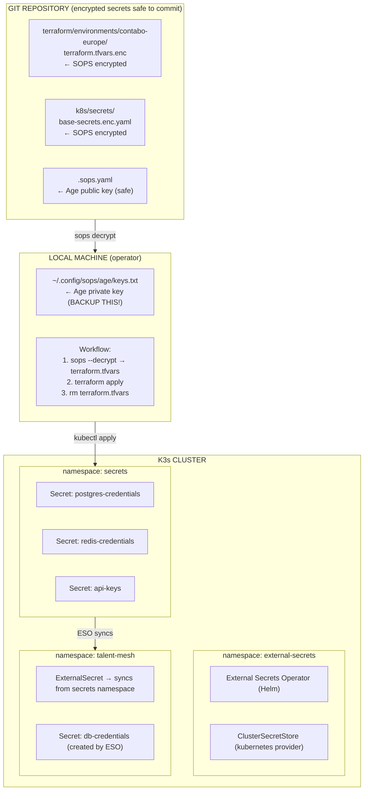

# ADR-013: Secrets Management with SOPS and External Secrets Operator

## Status
**Accepted** (2026-01-05)

## Date
2026-01-05

## Context

Talent Mesh requires secure secrets management for:
- **Infrastructure provisioning** (Terraform): Contabo API credentials, SSH keys
- **Kubernetes runtime**: Database passwords, API tokens, TLS certificates

Key constraints:
- **Zero cost**: No paid vault services (HashiCorp Vault Cloud, AWS Secrets Manager)
- **GitOps compatible**: Secrets must be version-controlled safely
- **IaC compliant**: New environments reproducible from git alone
- **Future-proof**: Easy migration to enterprise vault when scaling
- **Single source of truth**: No secrets scattered across systems

Options considered:
1. **HashiCorp Vault Cloud**: Paid service - rejected (cost)
2. **HashiCorp Vault (self-hosted)**: Complex to operate on 2-node cluster - deferred
3. **Kubernetes Secrets only**: Base64 encoded, not encrypted at rest - rejected (security)
4. **Sealed Secrets**: Cluster-specific keys, harder to bootstrap - rejected
5. **SOPS + age**: Simple, single key to manage, GitOps-friendly - **selected for Terraform**
6. **External Secrets Operator**: Abstraction layer, swappable backends - **selected for K8s**

## Decision

We will use a **two-layer secrets architecture**:

### Layer 1: Infrastructure Secrets (Terraform)
**Tool:** SOPS with age encryption

- Terraform `.tfvars` files encrypted with SOPS
- Single age keypair for all infrastructure secrets
- Encrypted files committed to git (`.tfvars.enc`)
- Decryption at deploy time only

### Layer 2: Kubernetes Secrets (Runtime)
**Tool:** External Secrets Operator with Kubernetes provider

- ESO installed in cluster from day 1
- MVP: ESO reads from K8s Secrets in `secrets` namespace (SOPS-decrypted)
- Future: Swap backend to HashiCorp Vault without application changes
- Applications use `ExternalSecret` CRDs (never change)

### Architecture



### Migration Path to Enterprise Vault

```yaml
# MVP: Kubernetes provider (reads from secrets namespace)
apiVersion: external-secrets.io/v1beta1
kind: ClusterSecretStore
metadata:
  name: main-store
spec:
  provider:
    kubernetes:
      remoteNamespace: secrets
      server:
        caProvider:
          type: ConfigMap
          name: kube-root-ca.crt
          key: ca.crt

---
# FUTURE: Swap to Vault (only this file changes)
apiVersion: external-secrets.io/v1beta1
kind: ClusterSecretStore
metadata:
  name: main-store
spec:
  provider:
    vault:
      server: "https://vault.talent-mesh.io"
      path: "secret"
      auth:
        kubernetes:
          mountPath: "kubernetes"
          role: "external-secrets"
```

**Key insight:** `ExternalSecret` manifests in application namespaces never change. Only `ClusterSecretStore` configuration changes when migrating to Vault.

### Secret Types and Ownership

| Secret | Layer | Storage | Rotation | Owner |
|--------|-------|---------|----------|-------|
| Contabo API credentials | Terraform | SOPS → local | On compromise | Operator |
| SSH keys | Terraform | SOPS → local | Annually | Operator |
| K3s token | Terraform | tfstate (local) | On rebuild | Terraform |
| DB passwords | K8s | ESO → Secrets | 90 days | ESO |
| API tokens | K8s | ESO → Secrets | On compromise | ESO |
| TLS certs | K8s | cert-manager | Auto (60 days) | cert-manager |
| JWT signing keys | K8s | ESO → Secrets | 30 days | ESO |

### Age Key Management

```bash
# Generate age keypair (ONE TIME per environment)
age-keygen -o ~/.config/sops/age/keys.txt

# Output:
# Public key: age1ql3z7hjy54pw3hyww5ayyfg7zqgvc7w3j2elw8zmrj2kg5sfn9aqmcac8p
# Created: ~/.config/sops/age/keys.txt (PRIVATE - backup this!)

# Backup strategy:
# 1. Store in password manager (1Password, Bitwarden)
# 2. Print and store in physical safe
# 3. NEVER commit to git
# 4. NEVER share via unencrypted channels
```

## Consequences

### Positive
- **Zero cost**: No paid vault services
- **GitOps friendly**: Encrypted secrets in version control
- **Simple operations**: Single age key for all infrastructure
- **Future-proof**: ESO abstraction enables vault migration
- **Auditable**: Git history shows secret changes (encrypted)
- **Reproducible**: New environments from git + age key
- **Standard tooling**: SOPS and ESO are industry standard

### Negative
- **Key management**: Age private key must be securely backed up
- **Manual rotation**: No automatic secret rotation (MVP)
- **Two systems**: SOPS for Terraform, ESO for K8s
- **Learning curve**: Team must learn SOPS workflow

### Mitigations
- Document age key backup in runbook
- Schedule manual rotation reminders
- Clear separation: Terraform vs K8s secrets
- Provide helper scripts for common operations

## Implementation

### Files Created

```
.sops.yaml                                    # Root SOPS config
scripts/
├── setup-sops.sh                             # Install SOPS + age
├── encrypt-secrets.sh                        # Encrypt helper
└── decrypt-secrets.sh                        # Decrypt helper
terraform/
└── environments/contabo-europe/
    └── terraform.tfvars.enc                  # Encrypted tfvars
k8s/
├── infrastructure/external-secrets/          # ESO installation
└── secrets/                                  # Master secrets
docs/
├── 06-technical-specs/SECRETS_MANAGEMENT.md  # Detailed guide
└── 08-operations/INFRASTRUCTURE_SETUP.md     # IaC setup guide
```

### Prerequisites

```bash
# Install SOPS
brew install sops  # macOS
# or: apt install sops  # Debian/Ubuntu

# Install age
brew install age  # macOS
# or: apt install age  # Debian/Ubuntu

# Generate age keypair
mkdir -p ~/.config/sops/age
age-keygen -o ~/.config/sops/age/keys.txt
```

## References

- [SOPS Documentation](https://github.com/getsops/sops)
- [age Encryption](https://github.com/FiloSottile/age)
- [External Secrets Operator](https://external-secrets.io/)
- [ADR-014: Contabo VPS Infrastructure](./ADR-014-CONTABO-VPS-INFRASTRUCTURE.md)
- [INFRASTRUCTURE_SETUP.md](../08-operations/INFRASTRUCTURE_SETUP.md)
- [SECRETS_MANAGEMENT.md](../06-technical-specs/SECRETS_MANAGEMENT.md)
