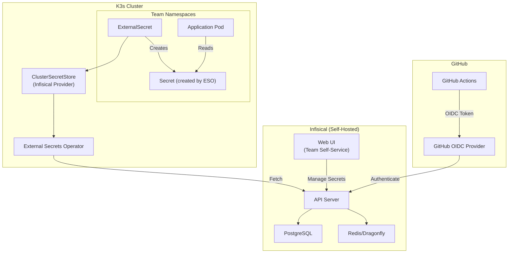

# ADR-039: Secrets Management with Infisical

## Status
**Accepted** (Supersedes ADR-013)

## Date
2026-01-09

## Context

OpenOva is an enterprise platform with 20+ products, where each product team operates like an independent hosted customer. This requires secrets management that enables:

- **Maximum team autonomy** - Teams manage their own secrets without SRE/platform tickets
- **Zero cost preference** - Minimize paid services during MVP
- **GitHub OIDC authentication** - No long-lived credentials
- **Air-gap compatible** - Works in regulated environments (banks)

ADR-013 established SOPS + ESO for secrets management. This ADR supersedes it with Infisical for enhanced self-service capabilities.

Options evaluated:
1. **SOPS + ESO (ADR-013)**: Good for small teams, but no UI, no audit trail
2. **HashiCorp Vault**: Complex to operate, expensive (Cloud), overkill for MVP
3. **Infisical**: Open-source, self-hosted, UI, GitHub OIDC, ESO-compatible
4. **AWS Secrets Manager**: Vendor lock-in, cost, not self-hosted

## Decision

We will use **Infisical** (self-hosted) with **External Secrets Operator (ESO)** for secrets management.

### Architecture



### Why Infisical Over SOPS + ESO

| Factor | SOPS + ESO | Infisical |
|--------|------------|-----------|
| Self-service UI | None | Web UI |
| Team autonomy | Requires git push | Direct access |
| Audit trail | Git commits only | Built-in audit log |
| Secret rotation | Manual | Scheduled |
| GitHub OIDC | Not applicable | Native support |
| ESO integration | K8s provider | Infisical provider |
| Air-gap support | Yes (git-based) | Yes (self-hosted) |

### Team Autonomy Model

```yaml
# Infisical project structure
infisical-projects/
├── talent-mesh/              # Product team project
│   ├── dev/                  # Dev environment secrets
│   ├── staging/              # Staging environment secrets
│   └── prod/                 # Prod environment secrets
├── hr-platform/              # Another product team
│   ├── dev/
│   ├── staging/
│   └── prod/
└── platform-shared/          # Shared infrastructure secrets
    ├── databases/
    ├── monitoring/
    └── certificates/
```

**Team Permissions:**
- Product teams: Full access to their project, all environments
- Platform team: Full access to platform-shared, read-only to products
- CI/CD (GitHub OIDC): Read-only to specific paths

### GitHub OIDC Authentication

```yaml
# GitHub Actions workflow
name: Deploy
on:
  push:
    branches: [main]

jobs:
  deploy:
    runs-on: ubuntu-latest
    permissions:
      id-token: write  # Required for OIDC
      contents: read

    steps:
      - name: Get secrets from Infisical
        uses: Infisical/secrets-action@v1
        with:
          method: oidc
          project-slug: talent-mesh
          env-slug: prod
          # No client-id or client-secret needed!
```

### ESO Integration

```yaml
# ClusterSecretStore for Infisical
apiVersion: external-secrets.io/v1beta1
kind: ClusterSecretStore
metadata:
  name: infisical-store
spec:
  provider:
    infisical:
      url: https://secrets.openova.io
      auth:
        serviceToken:
          secretRef:
            name: infisical-service-token
            key: token
            namespace: external-secrets

---
# ExternalSecret referencing Infisical
apiVersion: external-secrets.io/v1beta1
kind: ExternalSecret
metadata:
  name: talent-mesh-db-credentials
  namespace: talent-mesh
spec:
  refreshInterval: 1h
  secretStoreRef:
    name: infisical-store
    kind: ClusterSecretStore
  target:
    name: db-credentials
  data:
    - secretKey: POSTGRES_PASSWORD
      remoteRef:
        key: /talent-mesh/prod/POSTGRES_PASSWORD
```

### PushSecret for Bi-Directional Sync

```yaml
# PushSecret - Kubernetes → Infisical
apiVersion: external-secrets.io/v1alpha1
kind: PushSecret
metadata:
  name: push-generated-certs
  namespace: talent-mesh
spec:
  secretStoreRefs:
    - name: infisical-store
      kind: ClusterSecretStore
  selector:
    secret:
      name: tls-certificate
  data:
    - match:
        secretKey: tls.crt
        remoteRef:
          remoteKey: /talent-mesh/prod/TLS_CERT
```

### Resource Overhead

| Component | Memory | CPU |
|-----------|--------|-----|
| infisical-server | 512Mi | 250m |
| infisical-frontend | 128Mi | 50m |
| PostgreSQL (shared) | 0 | 0 |
| Dragonfly (shared) | 0 | 0 |
| **Total** | **~640Mi** | **~300m** |

## Consequences

### Positive

1. **Team self-service**: UI for secret management without git/CLI
2. **Audit trail**: Built-in logging of all secret access/changes
3. **GitHub OIDC**: No long-lived CI/CD credentials
4. **ESO compatible**: ExternalSecret CRDs unchanged from ADR-013
5. **Secret rotation**: Scheduled automatic rotation
6. **Air-gap ready**: Self-hosted, no external dependencies

### Negative

1. **Additional infrastructure**: ~640Mi for Infisical server
2. **Learning curve**: New UI/API to learn
3. **Migration effort**: Move secrets from SOPS to Infisical

### Neutral

1. **SOPS still used**: For Terraform bootstrap secrets only
2. **ESO abstraction**: Application manifests unchanged

## Implementation

### MVP Setup

```bash
# Deploy Infisical via Helm
helm repo add infisical https://infisical.github.io/helm-charts
helm install infisical infisical/infisical \
  --namespace infisical \
  --create-namespace \
  --set postgresql.enabled=false \
  --set postgresql.externalDatabase.host=postgres-cluster-rw.databases \
  --set redis.enabled=false \
  --set redis.externalRedis.host=dragonfly.databases

# Configure GitHub OIDC
# In Infisical UI: Settings → Authentication → GitHub OIDC
# Add organization: openova
# Add repository patterns: openova/*
```

### Migration from SOPS

```bash
# 1. Export existing secrets from SOPS
sops -d terraform.tfvars.enc > secrets.json

# 2. Import to Infisical via CLI
infisical secrets set --env=prod \
  CONTABO_API_KEY="$(jq -r .contabo_api_key secrets.json)"

# 3. Update ExternalSecrets to use Infisical provider
# (ClusterSecretStore change only)

# 4. Verify secrets sync
kubectl get secret -n talent-mesh db-credentials -o yaml
```

## References

- [Infisical Documentation](https://infisical.com/docs)
- [Infisical GitHub OIDC](https://infisical.com/docs/integrations/platforms/github)
- [External Secrets Operator - Infisical](https://external-secrets.io/latest/provider/infisical/)
- [ADR-013: SOPS + ESO](/docs/09-adrs/ADR-013-SECRETS-SOPS-ESO.md) (superseded)
- [ADR-037: Zero-Human-Intervention Ops](/docs/09-adrs/ADR-037-ZERO-HUMAN-INTERVENTION-OPS.md)

---

*ADR Version: 1.0*
*Last Updated: 2026-01-09*
