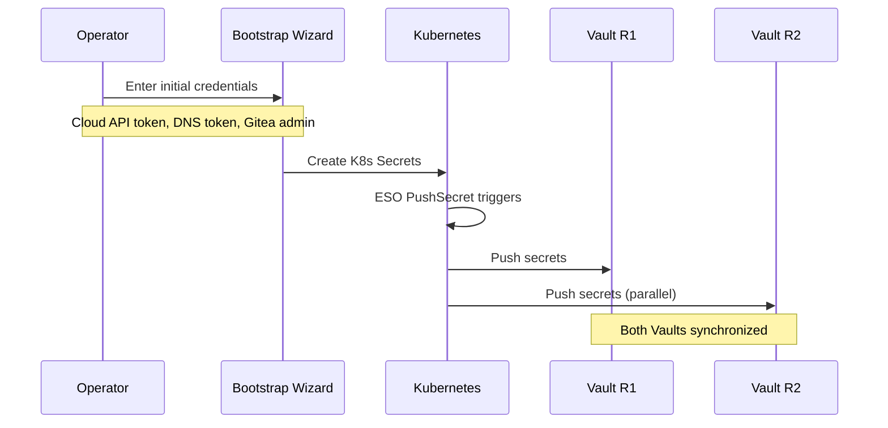

# ADR: Secrets Management with ESO + PushSecrets

**Status:** Accepted
**Date:** 2024-04-01
**Updated:** 2026-01-17

## Context

Need secure secrets management that:
- Never stores secrets in Git (no SOPS)
- Works across multiple regions
- Supports auto-generation of complex secrets
- Is fully declarative and GitOps-compatible
- Manages Gitea access tokens for Flux

## Decision

Use **External Secrets Operator (ESO)** with **100% PushSecrets** architecture. Kubernetes Secrets are the source of truth, pushed to external backends.

**Critical:** SOPS is completely eliminated. No secrets in Git, ever.

## Architecture


## Key Principles

| Principle | Implementation |
|-----------|----------------|
| No secrets in Git | SOPS eliminated, interactive bootstrap |
| K8s is source of truth | All secrets originate as K8s Secrets |
| Push, not pull | PushSecrets push to backends |
| Multi-region sync | Push to both Vaults simultaneously |
| Auto-generation | ESO Generators create complex secrets |

## Secret Flow

### Initial Bootstrap



### Auto-Generated Secrets


## Gitea Token Management

Gitea access tokens for Flux are managed via ESO:

### Bootstrap Creates Gitea Token

```yaml
apiVersion: v1
kind: Secret
metadata:
  name: gitea-token
  namespace: flux-system
type: Opaque
data:
  username: Zm... # base64 encoded username
  password: Z2l... # base64 encoded Gitea access token
```

### PushSecret Syncs to Vault

```yaml
apiVersion: external-secrets.io/v1alpha1
kind: PushSecret
metadata:
  name: push-gitea-token
  namespace: flux-system
spec:
  refreshInterval: 1h
  secretStoreRefs:
    - name: vault-region1
      kind: ClusterSecretStore
    - name: vault-region2
      kind: ClusterSecretStore
  selector:
    secret:
      name: gitea-token
  data:
    - match:
        secretKey: password
        remoteRef:
          remoteKey: flux/gitea-token
          property: password
```

### Flux Uses Token

```yaml
apiVersion: source.toolkit.fluxcd.io/v1
kind: GitRepository
metadata:
  name: component
  namespace: flux-system
spec:
  url: https://gitea.<domain>/<org>/component.git
  secretRef:
    name: gitea-token  # ESO-managed
```

## Configuration

### ESO Password Generator

```yaml
apiVersion: generators.external-secrets.io/v1alpha1
kind: Password
metadata:
  name: db-password-generator
  namespace: databases
spec:
  length: 32
  digits: 6
  symbols: 4
  noUpper: false
  allowRepeat: true
---
apiVersion: external-secrets.io/v1beta1
kind: ExternalSecret
metadata:
  name: db-password
  namespace: databases
spec:
  refreshInterval: "0"  # Generate once, never refresh
  target:
    name: db-credentials
    creationPolicy: Owner
  dataFrom:
    - sourceRef:
        generatorRef:
          apiVersion: generators.external-secrets.io/v1alpha1
          kind: Password
          name: db-password-generator
```

### PushSecret to Multiple Backends

```yaml
apiVersion: external-secrets.io/v1alpha1
kind: PushSecret
metadata:
  name: push-db-credentials
  namespace: databases
spec:
  refreshInterval: 1h
  secretStoreRefs:
    - name: vault-region1
      kind: ClusterSecretStore
    - name: vault-region2
      kind: ClusterSecretStore
  selector:
    secret:
      name: db-credentials
  data:
    - match:
        secretKey: password
        remoteRef:
          remoteKey: databases/db-credentials
          property: password
```

### ClusterSecretStore for Vault

```yaml
apiVersion: external-secrets.io/v1beta1
kind: ClusterSecretStore
metadata:
  name: vault-region1
spec:
  provider:
    vault:
      server: "https://vault-r1.<domain>"
      path: "secret"
      version: "v2"
      auth:
        kubernetes:
          mountPath: "kubernetes"
          role: "external-secrets"
          serviceAccountRef:
            name: external-secrets
            namespace: external-secrets
---
apiVersion: external-secrets.io/v1beta1
kind: ClusterSecretStore
metadata:
  name: vault-region2
spec:
  provider:
    vault:
      server: "https://vault-r2.<domain>"
      path: "secret"
      version: "v2"
      auth:
        kubernetes:
          mountPath: "kubernetes"
          role: "external-secrets"
          serviceAccountRef:
            name: external-secrets
            namespace: external-secrets
```

## Supported Backends

| Backend | Type | Notes |
|---------|------|-------|
| Vault Self-Hosted | Self-hosted | Recommended, full control |
| HCP Vault | Managed | HashiCorp Cloud |
| Infisical | Managed | Developer-friendly |
| AWS Secrets Manager | Managed | If AWS chosen |
| GCP Secret Manager | Managed | If GCP chosen |
| Azure Key Vault | Managed | If Azure chosen |

## Why No SOPS?

| SOPS Approach | PushSecrets Approach |
|---------------|---------------------|
| Secrets encrypted in Git | No secrets in Git |
| Manual age key management | Vault handles encryption |
| Decrypt before apply | K8s Secret is source |
| Risk of leaked decrypted files | Secrets never on disk |

**Decision:** Interactive bootstrap is simpler and more secure than SOPS.

## Bootstrap Procedure

1. **Operator enters credentials** in wizard (terminal input)
2. **Wizard creates K8s Secrets** directly via kubectl
3. **PushSecrets sync** to Vault backends
4. **Wizard displays Vault unseal keys** (save offline!)
5. **No secrets ever written to files or Git**

## Managed Secrets

| Secret | Purpose | Created By |
|--------|---------|------------|
| `gitea-token` | Flux access to Gitea | Bootstrap |
| `cloudflare-credentials` | ExternalDNS | Bootstrap |
| `hetzner-credentials` | Cloud provider | Bootstrap |
| `vault-unseal-keys` | Vault auto-unseal | Displayed once |
| `db-credentials` | Database passwords | ESO Generator |

## Generator Types

| Generator | Use Case |
|-----------|----------|
| Password | Database passwords, API keys |
| UUID | Unique identifiers |
| ECRAuthorizationToken | AWS ECR tokens |
| GCRAccessToken | GCP GCR tokens |
| ACRAccessToken | Azure ACR tokens |

## Consequences

**Positive:**
- No secrets in Git (eliminates leak risk)
- Auto-generation of complex secrets
- Multi-region sync via single PushSecret
- Backend-agnostic (swap without app changes)
- Gitea tokens managed consistently with all other secrets

**Negative:**
- Requires bootstrap for initial secrets
- ESO operator dependency
- Vault/backend operational overhead

## Migration from SOPS

If migrating from SOPS-based setup:

1. Create K8s Secrets from decrypted SOPS files
2. Create PushSecrets to sync to Vault
3. Verify secrets in Vault
4. Delete SOPS-encrypted files from Git
5. Delete local decrypted files

## Related

- [ADR-VAULT](../../vault/docs/ADR-VAULT.md)
- [ADR-GITEA](../../gitea/docs/ADR-GITEA.md)
- [ADR-FLUX-GITOPS](../../flux/docs/ADR-FLUX-GITOPS.md)
- [SPEC-SECRETS-CONFIGURATION](./SPEC-SECRETS-CONFIGURATION.md)
