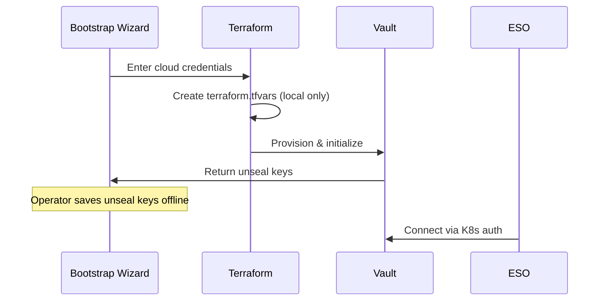

# SPEC: Secrets Management Configuration

## Overview

Two-layer secrets architecture: interactive bootstrap for infrastructure, ESO + Vault for Kubernetes.

**No SOPS:** Secrets are never stored in Git.

## Bootstrap Secrets Flow



## External Secrets Operator

### ClusterSecretStore (Vault)

```yaml
apiVersion: external-secrets.io/v1beta1
kind: ClusterSecretStore
metadata:
  name: vault-region1
spec:
  provider:
    vault:
      server: "https://vault.<domain>"
      path: "secret"
      version: "v2"
      auth:
        kubernetes:
          mountPath: "kubernetes"
          role: "external-secrets"
          serviceAccountRef:
            name: external-secrets
            namespace: external-secrets
```

### ExternalSecret Template

```yaml
apiVersion: external-secrets.io/v1beta1
kind: ExternalSecret
metadata:
  name: <service>-secrets
  namespace: <tenant>-prod
spec:
  refreshInterval: 1h
  secretStoreRef:
    name: vault-region1
    kind: ClusterSecretStore
  target:
    name: <service>-secrets
  data:
    - secretKey: DATABASE_URL
      remoteRef:
        key: <tenant>/postgres
        property: url
    - secretKey: API_KEY
      remoteRef:
        key: <tenant>/api-keys
        property: main
```

### ESO Password Generator

```yaml
apiVersion: external-secrets.io/v1beta1
kind: ExternalSecret
metadata:
  name: db-password
  namespace: databases
spec:
  refreshInterval: "0"  # Never refresh (generated once)
  target:
    name: db-credentials
    creationPolicy: Owner
  dataFrom:
    - sourceRef:
        generatorRef:
          apiVersion: generators.external-secrets.io/v1alpha1
          kind: Password
          name: db-password-generator
---
apiVersion: generators.external-secrets.io/v1alpha1
kind: Password
metadata:
  name: db-password-generator
  namespace: databases
spec:
  length: 32
  digits: 6
  symbols: 4
  noUpper: false
  allowRepeat: true
```

### PushSecret to Multiple Vaults

```yaml
apiVersion: external-secrets.io/v1alpha1
kind: PushSecret
metadata:
  name: push-db-credentials
  namespace: databases
spec:
  secretStoreRefs:
    - name: vault-region1
      kind: ClusterSecretStore
    - name: vault-region2
      kind: ClusterSecretStore
  selector:
    secret:
      name: db-credentials
  data:
    - match:
        secretKey: password
        remoteRef:
          remoteKey: databases/db-credentials
          property: password
```

## Secret Types

| Secret | Layer | Storage | Rotation |
|--------|-------|---------|----------|
| Cloud credentials | Bootstrap | Interactive (never stored) | On compromise |
| SSH keys | Bootstrap | Interactive (never stored) | On compromise |
| Vault unseal keys | Bootstrap | Offline backup | On compromise |
| Database passwords | K8s | ESO + Vault | 90 days |
| API keys | K8s | ESO + Vault | On compromise |
| JWT signing keys | K8s | ESO + Vault | 30 days |
| TLS certificates | K8s | cert-manager | Auto |
| Gitea tokens | K8s | ESO + Vault | 90 days |

## Critical Backup

The ONLY manual backup required:

- **Vault unseal keys** - Displayed once during bootstrap
- Backup: Password manager + physical copy

**Warning:** Losing unseal keys makes Vault secrets unrecoverable.

## Related

- [ADR-SECRETS-MANAGEMENT](./ADR-SECRETS-MANAGEMENT.md)
- [ADR-VAULT](../../vault/docs/ADR-VAULT.md)
